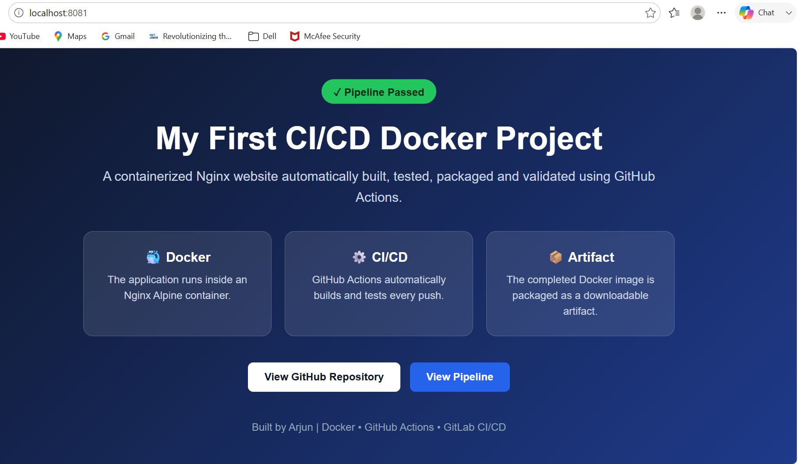
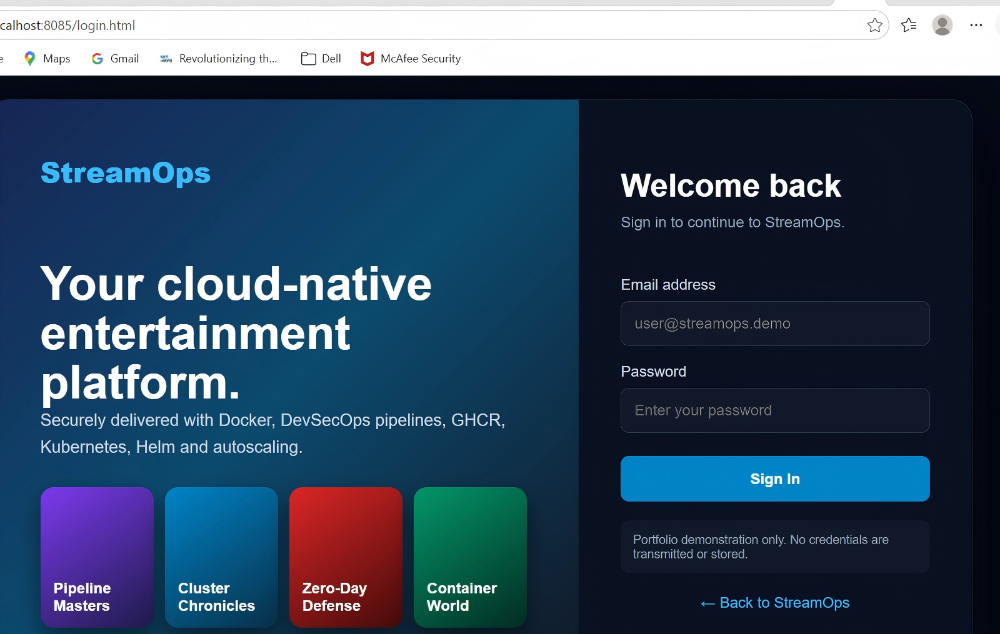

# StreamOps — Secure Cloud-Native Streaming Platform

## Project Overview

StreamOps is a secure cloud-native streaming-platform demonstration delivered through an end-to-end DevSecOps workflow. It integrates automated build, testing, security scanning, container publishing, artifact management, and Kubernetes deployment across GitHub Actions and GitLab CI/CD.

The implementation focuses on secure software delivery, repeatable deployments, application health validation, container traceability, and cross-platform CI/CD automation.

## Architecture

    Developer Commit
           |
           v
    GitHub / GitLab
           |
           v
    CI/CD Pipeline
           |
           +--> Application Testing
           +--> Semgrep SAST
           +--> Trivy Filesystem Scan
           +--> Docker Image Build
           +--> Trivy Image Scan
           +--> OWASP ZAP DAST
           +--> Security Reports
           |
           v
    GitHub Container Registry
           |
           v
    Kubernetes / Minikube
           |
           +--> Two Application Replicas
           +--> Kubernetes Service
           +--> ConfigMap
           +--> Readiness Probe
           +--> Liveness Probe
           +--> Resource Requests and Limits
           +--> Rolling Deployment

## Technologies

- Git and GitHub
- GitLab
- GitHub Actions
- GitLab CI/CD
- Docker and Nginx
- GitHub Container Registry
- Kubernetes and Minikube
- Semgrep
- Trivy
- OWASP ZAP
- PowerShell

## DevSecOps Pipeline

The automated delivery workflow performs:

1. Source-code checkout
2. Application build and endpoint testing
3. Semgrep static application security testing
4. Trivy filesystem and configuration scanning
5. Docker image creation
6. Trivy container-image vulnerability scanning
7. OWASP ZAP dynamic application security testing
8. Security-report and artifact upload
9. Docker image publishing to GHCR
10. Immutable image tagging using the Git commit SHA

## Kubernetes Implementation

The application is deployed with:

- Two Nginx replicas
- Rolling-update deployment strategy
- Kubernetes ConfigMap
- NodePort Service
- Readiness probe for traffic management
- Liveness probe for automatic recovery
- CPU and memory requests
- CPU and memory limits
- Local Minikube cluster

## Security Controls

| Area | Implementation |
|---|---|
| SAST | Semgrep |
| Filesystem scanning | Trivy |
| Container scanning | Trivy |
| DAST | OWASP ZAP |
| Image registry | GitHub Container Registry |
| Image traceability | Commit-SHA tags |
| Supply-chain metadata | SBOM and provenance |
| Runtime health | Liveness and readiness probes |
| Resource governance | Kubernetes requests and limits |

## Repository Structure

    my-first-pipeline/
    ├── .github/workflows/
    │   ├── pipeline.yml
    │   ├── security.yml
    │   └── publish-ghcr.yml
    ├── k8s/
    │   ├── app.yaml
    │   └── configmap.yaml
    ├── docs/images/
    │   └── project-preview.png
    ├── .gitlab-ci.yml
    ├── Dockerfile
    ├── index.html
    └── README.md

## Project Preview

## Run Locally with Docker

    docker build -t my-first-pipeline:local .
    docker run -d --name cicd-web -p 8081:80 my-first-pipeline:local

Open:

    http://localhost:8081

## Deploy to Kubernetes

    minikube start --driver=docker
    kubectl apply -f k8s/configmap.yaml
    kubectl apply -f k8s/app.yaml
    kubectl rollout status deployment/my-first-pipeline
    kubectl get pods,services
    minikube service my-first-pipeline

## Engineering Outcomes

- Implemented equivalent DevSecOps workflows in GitHub Actions and GitLab CI/CD.
- Automated build, application validation, security scanning, and artifact generation.
- Published immutable Docker images to GitHub Container Registry.
- Generated SBOM and provenance metadata for container images.
- Deployed the application to Kubernetes with two replicas.
- Implemented readiness and liveness probes for reliability and recovery.
- Added Kubernetes resource requests and limits.
- Resolved CI configuration, reserved-stage, Docker networking, Kubernetes context, and local-cluster issues.

## Interview Summary

I designed and implemented a production-style DevSecOps delivery workflow for a containerized Nginx application. GitHub Actions and GitLab CI/CD automate application testing, Semgrep SAST, Trivy filesystem and image scanning, and OWASP ZAP DAST. The validated image is published to GitHub Container Registry using immutable commit-SHA tags with SBOM and provenance metadata. I deployed the application to Kubernetes with two replicas, rolling updates, ConfigMaps, resource controls, and liveness and readiness probes.

## Scope

This portfolio project demonstrates senior-level DevOps and DevSecOps concepts. A full enterprise implementation would additionally include managed Kubernetes, Helm, GitOps with Argo CD, centralized secrets management, policy enforcement, TLS ingress, monitoring, alerting, and formal environment promotion.

## Application Preview

### StreamOps Home Page

### StreamOps Login Page

